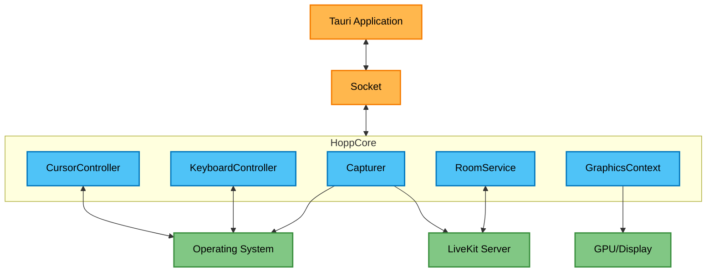
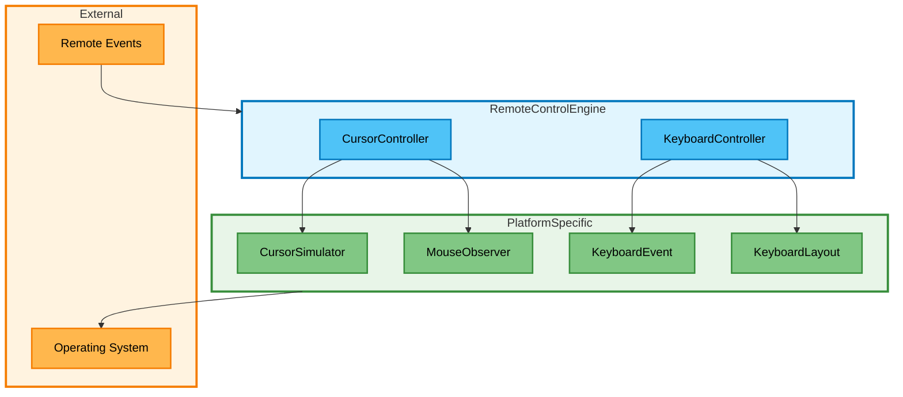
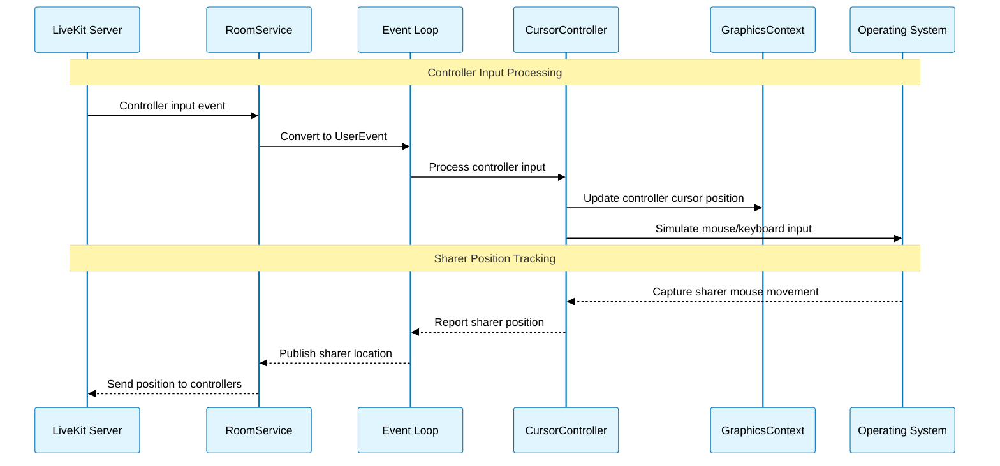
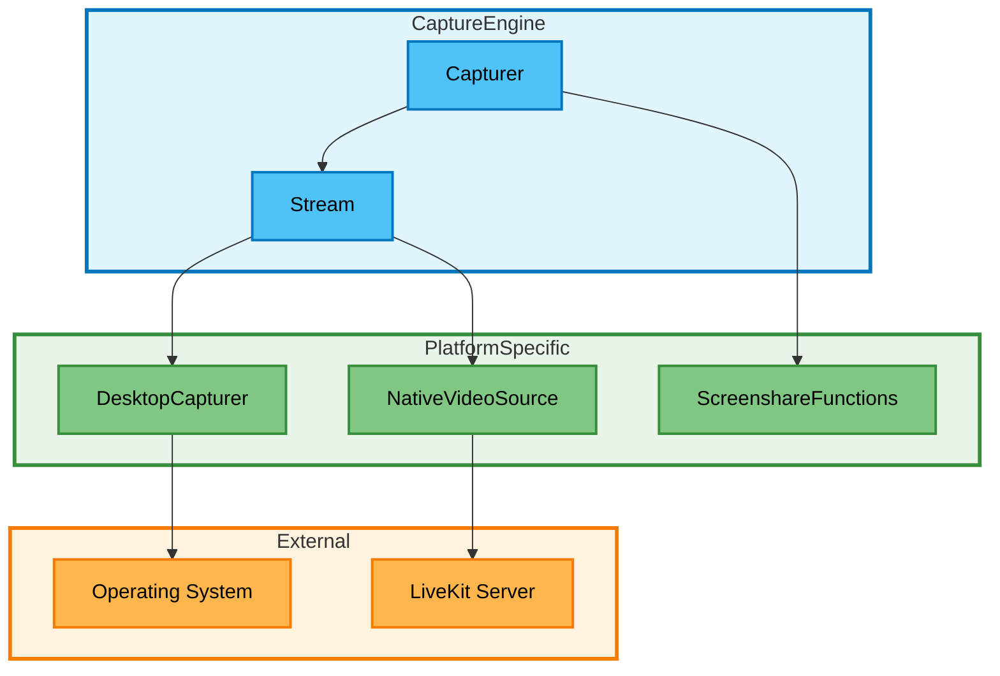
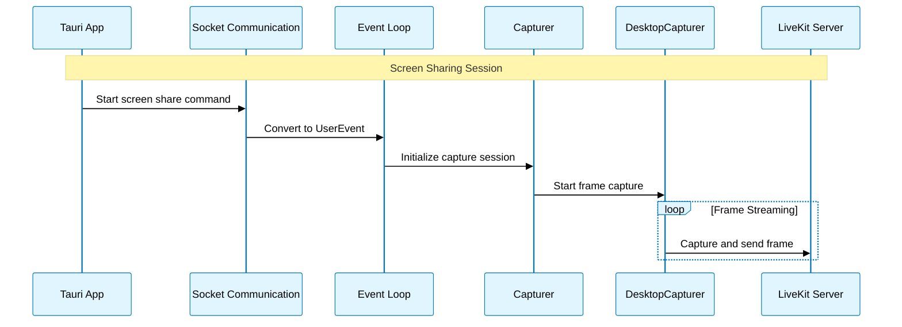

# Hopp Core

Hopp's remote desktop control and screen sharing engine. Handles screen capture, real-time streaming, multi-user input control, remote cursors
rendering.

## Quick Start

### Dependencies

We are using [Task](https://taskfile.dev/) as our build tool.

### Build and run
```bash
task build_dev
```
### Testing

Currently rust unit tests are missing (it's on our TODOs), but we have created a few visual integration
tests in the `tests` folder, for more details see the [README](tests/README.md).

A quick way to verify your changes would be to run `task build_dev` and then run a test from the `tests` folder.
For example:

```bash
task dev
# From a different terminal
cd tests/
cargo run -- cursor move
```

## Key Concepts

* **Sharer**: The user who is sharing their screen and allow remote control of their machine.
* **Controller**: A participant to the room who views the screen sharing stream and can
control the sharer's machine.

## Overview



The `Tauri` app starts the core process and communicates with it via a socket.

`HoppCore` manages two primary subsystems: the `Capturer` object responsible for screen capture and screenshot
generation, and the `RoomService` which handles asynchronous `LiveKit` operations.

During a screen sharing session the following happens:
* `RoomService` connects to the `LiveKit` room and creates the video stream infrastructure.
* `Capturer` begins capturing the selected display and sends frames to `LiveKit`'s `NativeVideoSource` buffer for real-time streaming.
* An overlay window is created for rendering the virtual cursors.
* Remote control is handled via the cursor and keyboard controllers.
* Controller input events arrive as `LiveKit` `DataPackets` through the room service, get converted to `UserEvents` in the event loop, and are forwarded to the appropriate input controllers for processing.

### Remote Control Engine



The remote control engine consist of two components:
* `CursorController`: Handles mouse and keyboard input from controllers.
* `KeyboardController`: Handles keyboard input from controllers.

Each component owns platform specific components which are using the platform specific apis.

#### CursorController

`CursorController` manages multi-user cursor interaction and visual feedback.

**Core Responsibility:**
* Coordinate control switching between sharer and controllers.
* Manage virtual cursor rendering on the overlay window.
* Handle input simulation through platform-specific components.

**Control Logic:**
* Only one cursor can have physical control at a time (OS limitation).
* Click or scroll events trigger control transfer to that cursor.
* Non-controlling cursors appear as virtual overlays.

**Events:**
* The movement and events of the controller cursor are arriving to the core process through the
  `WebRTC` data channel, then they are converted to `UserEvents` and forwarded to the cursor controller.
* The sharer's position is tracked by the mouse observer and broadcasted to the controllers via the
  `WebRTC` data channel.

**Platform Components:**
* **`MouseObserver`**: Captures local sharer mouse movements.
* **`CursorSimulator`**: Injects controller input into the `OS`.

Here follows a sequence diagram of the cursor controller:


#### KeyboardController

High-level controller for keyboard input simulation across platforms. The `KeyboardController`
orchestrates keyboard simulation by managing layout detection, key mapping, and event generation.

**Core Responsibility:**
* Automatically handle layout changes and rebuild key mapping tables.
* Provide simple interface for simulating keystrokes from high-level keystroke data.

**Platform Components:**
* **`KeyboardLayout`**: Detects layout changes and translates keycodes to characters.
* **`KeyboardEvent`**: Generates platform-specific keyboard events for the `OS`.

### Screen Capture



The `Capturer` manages the screen capture lifecycle and coordinates with `LiveKit` for real-time streaming.

**Core Responsibility:**
* Start/stop screen sharing sessions and manage capture streams.
* Generate thumbnails for content selection UI.
* Handle error recovery through automatic stream restart.
* Coordinate with `RoomService` for buffer sharing.

For platform-agnostic screen capturing, we use the `DesktopCapturer` object from our `LiveKit` fork
(we have modified `LiveKit` to expose libwebrtc's `DesktopCapturer`).

In the capture callback, which is called by the capturing thread, we process the captured buffer
and share it with `LiveKit`.

The platform-specific trait we have introduced is `ScreenshareFunctions`, which is used for
accessing the monitor ID. This requires different handling on each platform when using `winit`.

Here follows a sequence diagram of the capture engine:

